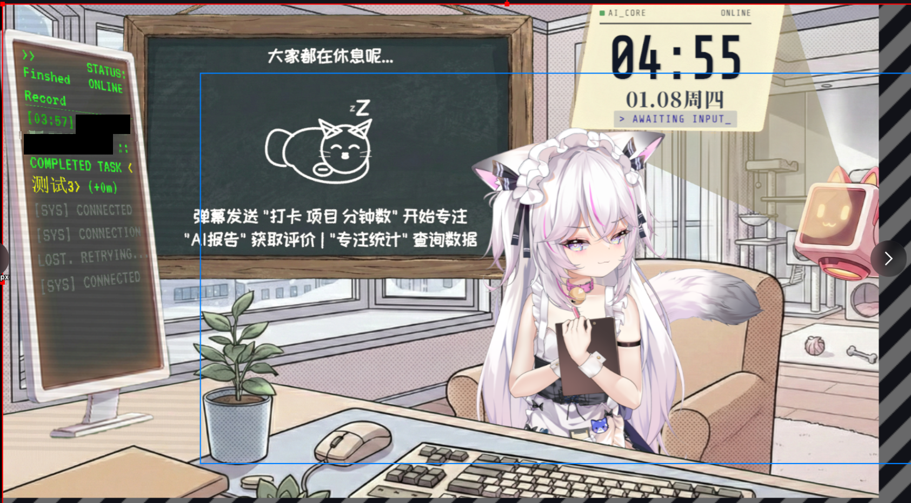

# Bilibili Study Room Live (自习室直播插件)

一个基于 Bilibili 直播开放平台的互动自习室插件。观众通过发送弹幕参与打卡、专注于学习，直播间实时展示学习进度、排行榜及 AI 生成的个性化报告。

# 预览

## ✨ 主要功能

### 1. 互动打卡 (Study Timer)

- **命令**: `打卡 学习 60` (项目/时长)
- **展示**: `index.html`
- **特性**:
  - 粉笔黑板风格 (Chalk Style)。
  - **空闲状态**: 当没有人自习时，自动展示 **"睡觉猫咪"** 动画 (SVG Chalk 风格)。
  - 实时进度条、每日累计时长统计。
  - 完成时播放 "高光时刻" 动画 (绿色进度条 + 红色对勾)。

### 2. AI 僚机挂件 (AI Wingman)

- **命令**: `AI报告` / `专注统计`
- **展示**: `ai_widget.html`
- **特性**:
  - 透明悬浮设计，适合 OBS 叠加。
  - **AI 智能评价**: 根据用户专注时长，生成 "毒舌" 或 "鼓励" 风格的短评 (支持流式打字机效果)。
  - 实时显示当前北京时间。
  - 支持中英文粗体字体优化 (`Chakra Petch` + `Noto Sans SC`)。

### 3. 数据排行榜 (Leaderboard)

- **展示**: `stats.html`
- **特性**:
  - 赛博朋克/复古终端风格。
  - 3D 翻转卡片展示 TOP 20 卷王。
  - 解决 OBS 透明背景下的闪烁问题。

### 4. 后台管理 (Admin Dashboard)

- **地址**: `http://localhost:3000/admin.html`
- **功能**:
  - 实时监控房间状态，强制跳过/结束用户。
  - 历史记录查询与删除。
  - **系统配置**: 可视化修改轮播间隔、Widget显示时长 (秒单位)、AI 提示词。

## 🛠️ 技术栈

- **Backend**: Node.js, TypeScript, OpenAI Compatible API
- **Frontend**: HTML5, Tailwind CSS, Alpine.js
- **Database**: Better-SQLite3
- **Live Platform**: Bilibili Open Platform (WebSocket)

## 🚀 快速开始

1. 配置 `.env` (B站凭证, AI Key)。
2. **双击运行 `start.bat`** (自动安装依赖、启动服务、打开后台)。
3. 在 OBS 中添加浏览器源:
   - 主画面: `http://localhost:3000`
   - 挂件: `http://localhost:3000/ai_widget.html`
   - 排行榜: `http://localhost:3000/stats.html`

## 📝 最近更新

- **猫咪彩蛋**: 优化了空闲状态的视觉体验，增加了一只酣睡的猫咪。
- **配置优化**: 后台可直接修改显示配置，无需重启服务。
- **视觉升级**: 全面优化字体显示和布局对齐。
